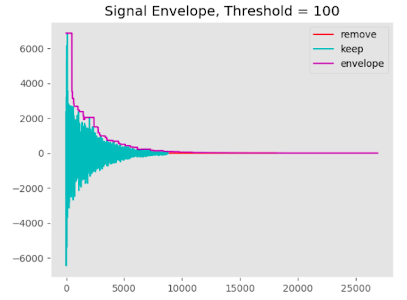
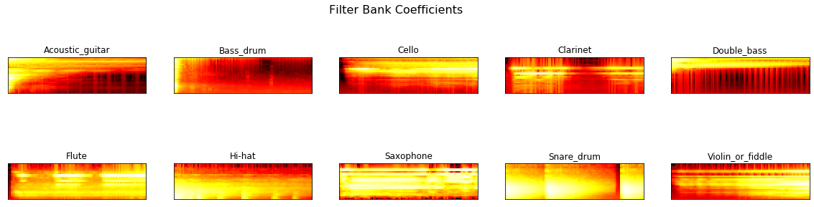
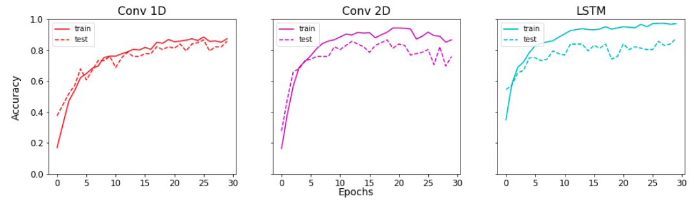

# Audio-Classification 

Pipeline for prototyping audio classification algorithms with TF 2.3


<!-- TOC -->

- [YouTube](#youtube)
- [Environment](#environment)
- [Jupyter Notebooks](#jupyter-notebooks)
- [Audio Preprocessing](#audio-preprocessing)
- [Training](#training)
- [Plot History](#plot-history)

<!-- /TOC -->

### YouTube

This project has been worked over the guidance of the following youtube playlist 

https://www.youtube.com/playlist?list=PLhA3b2k8R3t2Ng1WW_7MiXeh1pfQJQi_P


### Environment

```
conda create -n audio python=3.7
activate audio
pip install -r requirements.txt
```

### Jupyter Notebooks

Assuming you have ipykernel installed from your conda environment

`ipython kernel install --user --name=audio`

`conda activate audio`

`jupyter-notebook`

### Audio Preprocessing


`python eda.py`


signal envelope to cutoff at a threshold to remove low magnitude data



Filter bank coefficients of the Data



### Training

Change model_type to: conv, time

`python model.py`

### Plot History

Comparison between the 3 models: Conv1D, Conv2D, LSTM (RNN)



